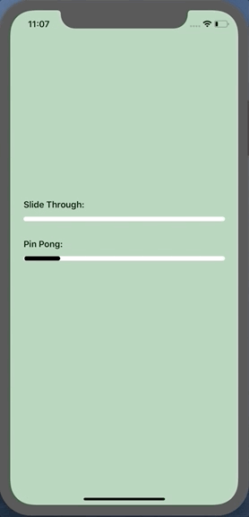
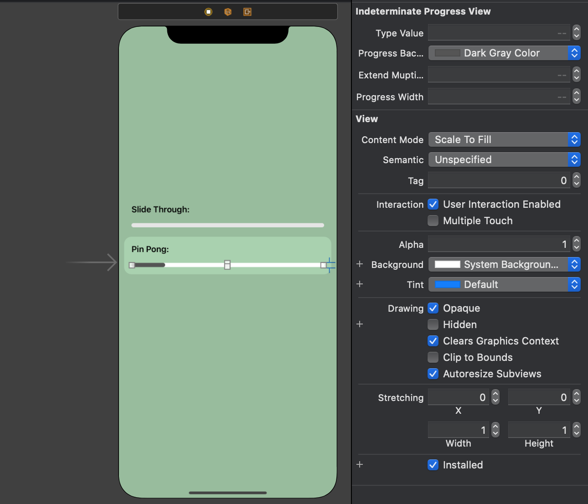

# IndeterminateProgress

Customizable `IndeterminateProgressView` **class** with two types of infinity animations. 

<p align="center">
  
</p>


# Quick Install
- Drag or copy this **class** into your project
- Play with `IndeterminateProgressView` attributes *(optional)*

### Programmatically
```
let progress = IndeterminateProgressView()
progress.animationDuration = 2.0
progress.progressBackgroundColor = .darkGray
progress.extendMuptiplier = 2
progress.progressWidth = 84
```

### Storyboard
Create `UIView` object and set `IndeterminateProgressView` type in the class field in the `Identity Inspector`.
`IndeterminateProgressView` component provides live rendering and expose the changing properties in an `Interface Builder`. 

See real-time results!

<p align="center">
  
</p>

# P.S.
I wrote this to show system status to user in [**Care app**](https://apps.apple.com/app/cares-go-cruelty-free/id1469018736) 🐰

I hope this is helpful!

🍿[**More iOS articles**](http://www.popcornomnom.com/) 🍿
